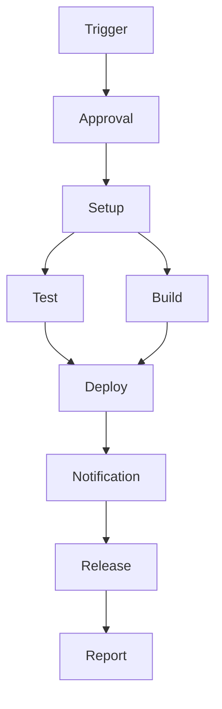

# 🚀 Workflows Modulares - Wasion Report

Este projeto foi reestruturado para usar workflows modulares com `workflow_call`, proporcionando melhor organização, reutilização e manutenibilidade.

## 📁 Estrutura dos Workflows

### 🔧 Workflows Reutilizáveis (Reusable Workflows)

1. **`approval-workflow.yml`** - 🔐 Aprovação Manual
   - Gerencia aprovações manuais para deploy
   - Notificações no Microsoft Teams
   - Timeout configurável
   - Suporte a multiple aprovadores

2. **`setup-workflow.yml`** - ⚙️ Setup do Ambiente
   - Configuração do ambiente de build
   - Limpeza de arquivos temporários
   - Configuração de cache e Docker Buildx
   - Notificação de início do processo

3. **`test-workflow.yml`** - 🧪 Testes
   - Testes de formatação (Ruff)
   - Testes unitários (pytest)
   - Configuração do Python e Poetry
   - Relatórios de cobertura

4. **`build-workflow.yml`** - 🐳 Build Docker
   - Build da imagem Docker
   - Testes da imagem Docker
   - Cache otimizado
   - Validação de healthcheck

5. **`deploy-workflow.yml`** - 🚀 Deploy
   - Deploy da aplicação
   - Transferência de arquivos via SCP
   - Execução remota de scripts
   - Configuração de serviços

6. **`notification-workflow.yml`** - 📢 Notificações
   - Notificações de sucesso/falha
   - Integração com Microsoft Teams
   - Relatórios detalhados
   - Status das etapas

7. **`release-workflow.yml`** - 📋 Release
   - Criação de releases no GitHub
   - Geração de changelog automático
   - Upload de artefatos
   - Notificações de release

### 🎯 Workflows Principais (Main Workflows)

1. **`deploy-test-modular.yml`** - Deploy para Teste
   - Executa em PRs para branches release
   - Ambiente de teste
   - Aprovação com timeout de 1 minuto

2. **`deploy-prod-modular.yml`** - Deploy para Produção
   - Executa em push para main
   - Ambiente de produção
   - Aprovação com timeout de 10 minutos

## 🔄 Fluxo de Execução

## 🛠️ Configuração

### Variáveis de Ambiente (Repository Variables)

#### Para Teste:
- `DEPLOY_TEST_APPROVAL` - Lista de aprovadores para teste
- `DEPLOY_TEST_HOST` - Servidor de teste
- `DEPLOY_TEST_USER` - Usuário para deploy de teste
- `DEPLOY_TEST_PATH` - Caminho de deploy de teste
- `MSTEAMS_WEBHOOK` - Webhook do Microsoft Teams

#### Para Produção:
- `DEPLOY_PROD_APPROVAL` - Lista de aprovadores para produção
- `DEPLOY_PROD_HOST` - Servidor de produção
- `DEPLOY_PROD_USER` - Usuário para deploy de produção
- `DEPLOY_PROD_PATH` - Caminho de deploy de produção

### Secrets

#### Para Teste:
- `DEPLOY_TEST_PASSWORD` - Senha para deploy de teste

#### Para Produção:
- `DEPLOY_PROD_PASSWORD` - Senha para deploy de produção

## 🚀 Vantagens da Estrutura Modular

### ✅ Benefícios:

1. **Reutilização** - Workflows podem ser reutilizados entre diferentes ambientes
2. **Manutenibilidade** - Easier to maintain and update individual components
3. **Testabilidade** - Cada workflow pode ser testado independentemente
4. **Organização** - Melhor estrutura e separação de responsabilidades
5. **Escalabilidade** - Fácil adição de novos ambientes ou funcionalidades

### 🔧 Flexibilidade:

- **Configuração por Ambiente** - Diferentes configurações para teste e produção
- **Timeout Configurável** - Diferentes timeouts de aprovação
- **Notificações Personalizadas** - Mensagens específicas por ambiente
- **Artefatos Separados** - Releases específicos por ambiente

## 📝 Como Usar

### Para Teste:
1. Criar PR para branch `release` ou `release/**`
2. Workflow será executado automaticamente
3. Aprovação manual necessária (1 minuto timeout)
4. Deploy automático após aprovação

### Para Produção:
1. Push para branch `main`
2. Workflow será executado automaticamente
3. Aprovação manual necessária (10 minutos timeout)
4. Deploy automático após aprovação

## 🔍 Monitoramento

### Notificações:
- Início do processo
- Solicitação de aprovação
- Aprovação/reprovação
- Sucesso/falha do deploy
- Criação de release

### Relatórios:
- Resumo das etapas
- Status de cada job
- Links para artefatos
- Métricas de execução

## 🛡️ Segurança

- Aprovação manual obrigatória
- Separação de ambientes
- Secrets isolados por ambiente
- Timeout de aprovação
- Logs detalhados

## 🚨 Troubleshooting

### Problemas Comuns:

1. **Workflow não executa**
   - Verificar triggers configurados
   - Verificar permissões do repositório

2. **Aprovação não funciona**
   - Verificar lista de aprovadores
   - Verificar permissões do GitHub Token

3. **Deploy falha**
   - Verificar conectividade com servidor
   - Verificar credenciais
   - Verificar logs detalhados

4. **Notificações não chegam**
   - Verificar webhook do Teams
   - Verificar configuração de variáveis

## 🔄 Migração do Workflow Antigo

O workflow original (`deploy-test.yml`) foi dividido em workflows modulares. Para migrar:

1. ✅ Workflows reutilizáveis criados
2. ✅ Workflows principais criados
3. ✅ Configuração documentada
4. ⚠️ Testar workflows modulares
5. ⚠️ Migrar variáveis e secrets
6. ⚠️ Remover workflow antigo após validação

## 📚 Próximos Passos

1. Implementar cache entre workflows
2. Adicionar métricas de performance
3. Criar workflow para staging
4. Implementar rollback automático
5. Adicionar testes de integração

---

*Documentação atualizada em: 16 de julho de 2025*
