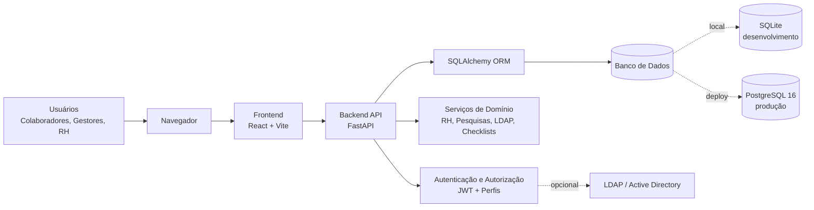
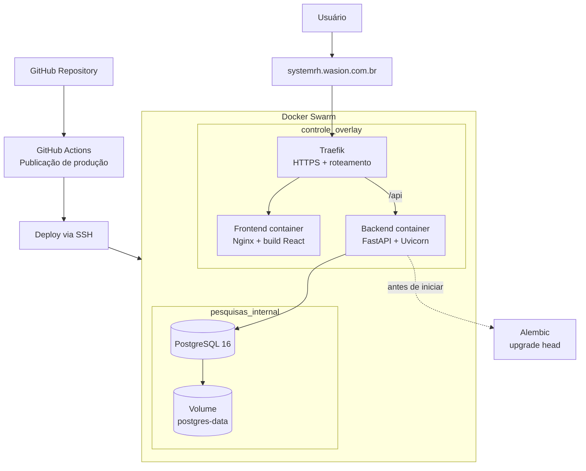
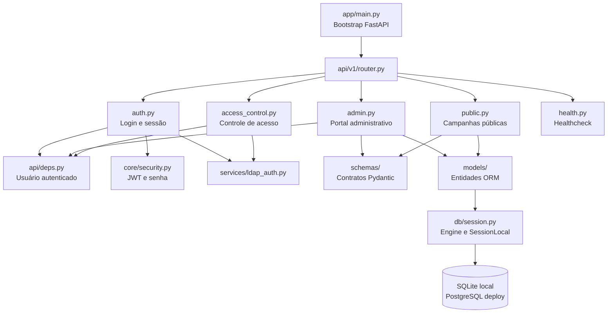
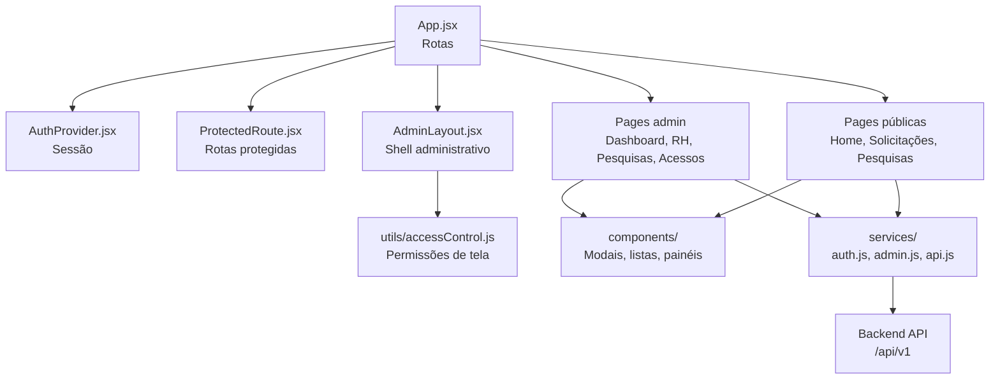
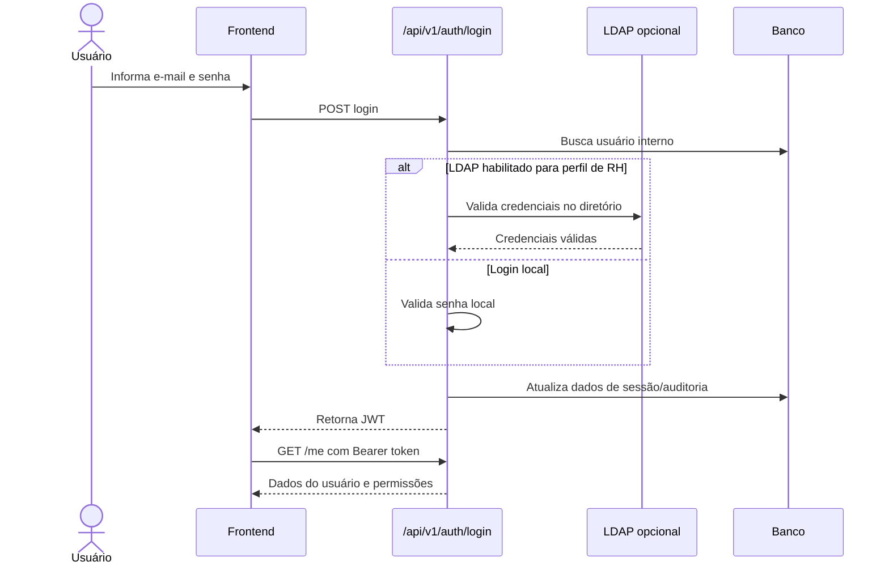
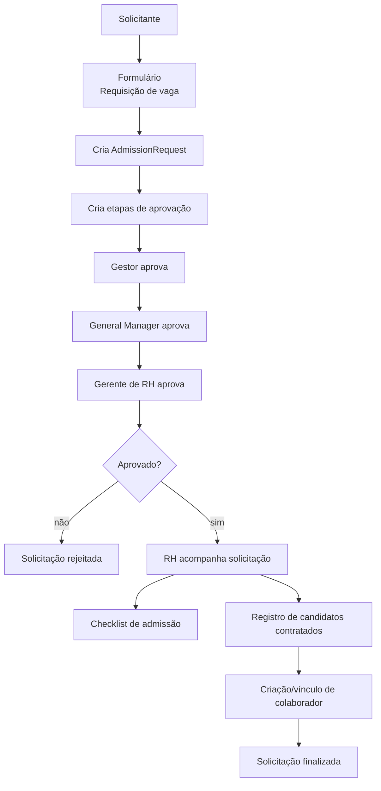
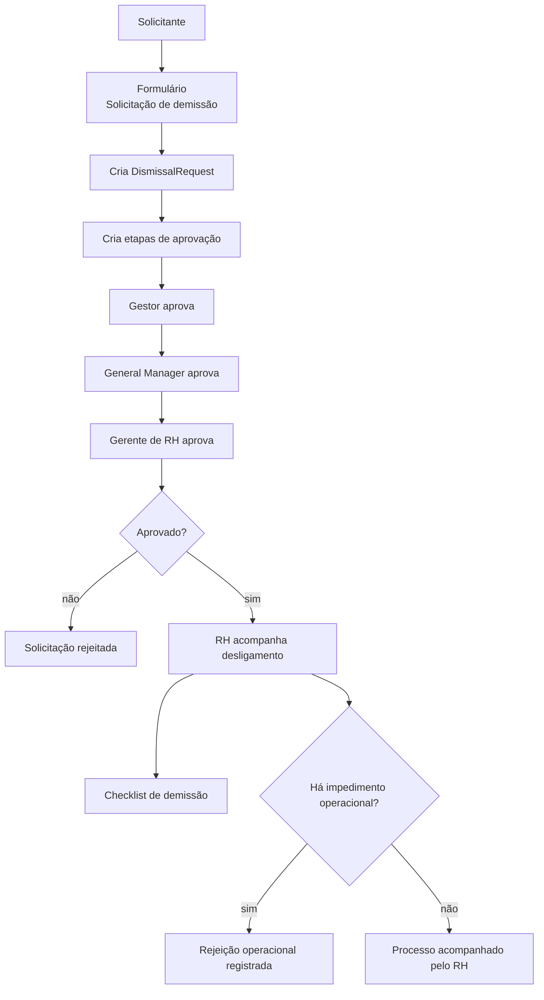
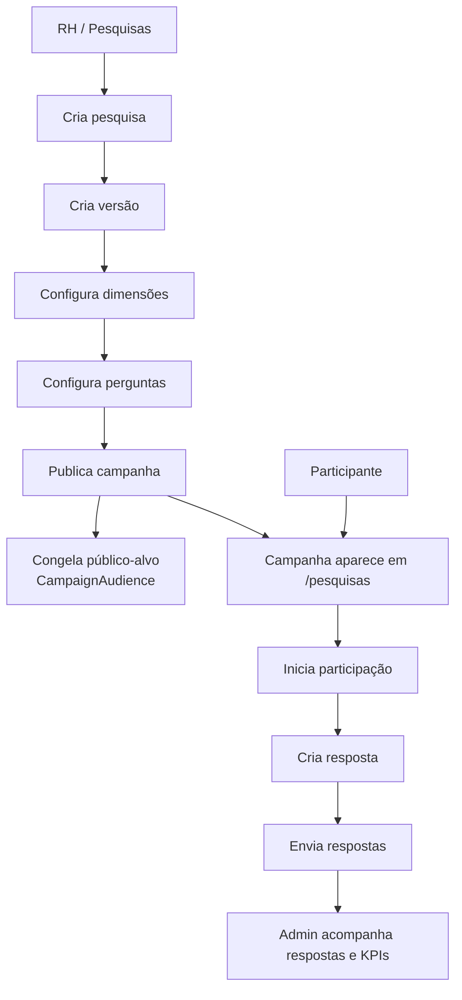
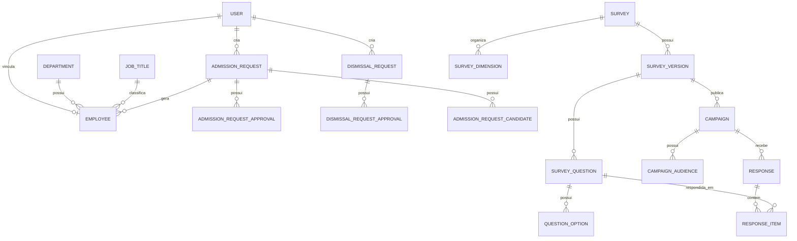
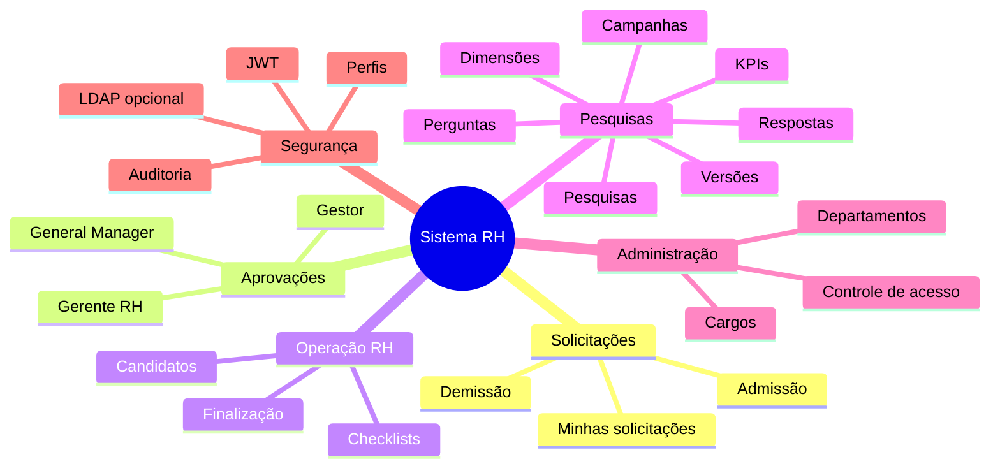

# Desenho da Arquitetura

Este arquivo apresenta a arquitetura do Sistema de Recursos Humanos em diagramas Mermaid. O GitHub renderiza estes blocos automaticamente na visualização do Markdown.

## 1. Visão Geral

## 2. Arquitetura de Deploy

## 3. Camadas do Backend

## 4. Camadas do Frontend

## 5. Fluxo de Login

## 6. Fluxo de Admissão

## 7. Fluxo de Demissão

## 8. Fluxo de Pesquisas

## 9. Modelo de Dados Simplificado

## 10. Responsabilidades por Módulo

